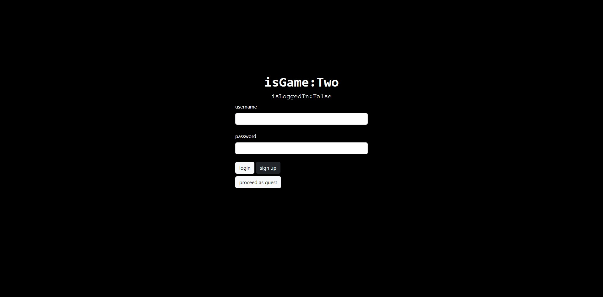

  # isGame:Two 🎮
  

    if (app.isGame) {
      playGame();
      relax();
      checkOutDeveloperGithubs()
    }

  isGame:Two is a single-player platformer RPG. It is a continuation of development for [isGameTrue](https://github.com/brandonkylely/isGame-True).

  Assume the role of a hooded swordsman in this 8-bit style RPG adventure! Orcs and pigs spawn throughout each level to try and stop you in your tracks, so only the bravest adventurers will make it through. At the end of each game, users can submit their total scores to a global leaderboard to see how they stack up against the best of the best!

  ## Site Link 💡
  
  https://isgame-two-89dd87bf525a.herokuapp.com/

  ## Table of Contents 📃

  [Technologies Used ⚙️](#technologies-used)

  [Usage 🤔](#usage)

  [Developer Roadmap 🗺️](#developer-roadmap)

  [Developer](#developer)

  [Visuals 📺](#visuals)

  [Acknowledgements 🤝](#art-credits)

  [License](#license)

  ## Technologies Used 
  ⚙️

  Express.js, Node.js, Sequelize ORM, Phaser.io, Tiled, Handlebars.js, RESTful API, MySQL, Heroku, HTML, CSS

  ## Usage 
  🤔
  First time users will need to, register for an account. Returning users can login with their existing credentials. After login, users will be redirected to the game menu, where you can start a new game, see the instructions, or navigate to the leaderboards. 

  ## Developer Roadmap 
  🗺️

  - Procedurally generated levels.
  
  - Coop functionality.

  - Customizable player sprites.
  
  ### Game Instructions

  Use space bar to jump and WASD keys for direction movement and sword aiming. Use P to pause the game and take a break 💤. Collect coins and defeat enemies to gain points, and enter the door to move to the next stage! Avoid being hit too many times, as getting hit reduces your end-of-stage point multiplier and losing all lives will result in a game over!

  ## Developer 

  Brandon Ly 🫠 : [Github](https://github.com/brandonkylely) & [LinkedIn](https://www.linkedin.com/in/brandon-ly-7300b1205/) & [Email](mailto:brandonkly@ucla.edu)

  ## Visuals 
  📺
  
  
  
  

  ## Art Credits 
  🪙

  Level 1 & 3 Background Art by Tori, @torean.art on instagram

  Level 2 Background Art Credit, © 2012-2013 Julien Jorge <julien.jorge@stuff-o-matic.com>, https://opengameart.org/content/large-forest-background

  Platform Tiles, Stars and Springs by Kenny, https://www.kenney.nl/assets/platformer-art-deluxe

  Protagonist Spritesheet by Penzilla, https://penzilla.itch.io/hooded-protagonist

  Sword Art by SnoopethDuckDuck, https://snoopethduckduck.itch.io/swords

  Sound Effects: 8 bit + 16 bit Sound Effects © 2022 by ivy is licensed under CC BY 4.0, https://ivyism.itch.io/8-16-bit-half-life

  Enemy Sprites by Kacper Woźniak, This work is licensed under a Creative Commons Attribution 4.0 International License, https://thkaspar.itch.io/micro-character-bases

  Background Music - Music : Sakura Girl - Morning Sun Link : https://youtu.be/OQAQ8WjszZM

  ## License
  MIT License

  Copyright (c) 2018 samme and contributors

  Permission is hereby granted, free of charge, to any person obtaining a copy
  of this software and associated documentation files (the "Software"), to deal
  in the Software without restriction, including without limitation the rights
  to use, copy, modify, merge, publish, distribute, sublicense, and/or sell
  copies of the Software, and to permit persons to whom the Software is
  furnished to do so, subject to the following conditions:

  The above copyright notice and this permission notice shall be included in all
  copies or substantial portions of the Software.

  THE SOFTWARE IS PROVIDED "AS IS", WITHOUT WARRANTY OF ANY KIND, EXPRESS OR
  IMPLIED, INCLUDING BUT NOT LIMITED TO THE WARRANTIES OF MERCHANTABILITY,
  FITNESS FOR A PARTICULAR PURPOSE AND NONINFRINGEMENT. IN NO EVENT SHALL THE
  AUTHORS OR COPYRIGHT HOLDERS BE LIABLE FOR ANY CLAIM, DAMAGES OR OTHER
  LIABILITY, WHETHER IN AN ACTION OF CONTRACT, TORT OR OTHERWISE, ARISING FROM,
  OUT OF OR IN CONNECTION WITH THE SOFTWARE OR THE USE OR OTHER DEALINGS IN THE
  SOFTWARE.
